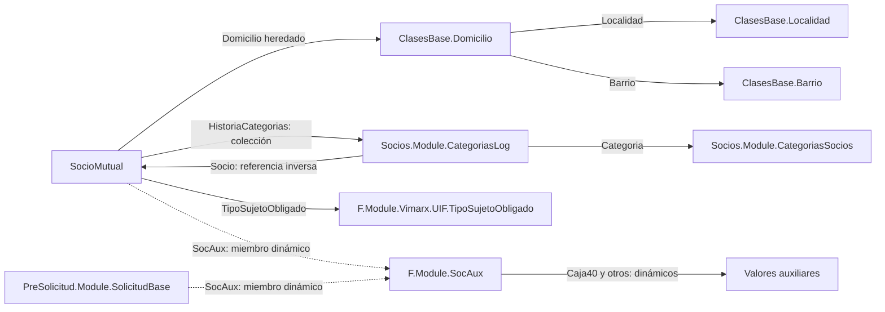

# Modelo reconstruido desde el cliente Vimarx

Inspección estática del **15/09/2026** de la copia local `Desktop/SociosUpdate`.
Se leyeron metadatos .NET e instrucciones IL mediante Mono.Cecil. No se ejecutó
el cliente, no se invocaron sus métodos ni se conectó a bases o APIs durante esta
inspección. No se publican binarios, configuración de conexión ni secretos.

El resultado inicial cubre **30 tipos seleccionados, 763 propiedades declaradas
y 12 registros dinámicos**. Es un mapa del cliente, no una lista de campos
permitidos por CrearSocioMutual. Las versiones del servidor pueden ser distintas.

## Herencia y relaciones

La herencia observada es:

```text
F.Module.SocioMutual
  hereda Socios.Module.PersonasSocios
    hereda ClasesBase.Persona
      hereda ClasesBase.PersonaBase
        hereda ClasesBase.VXBaseObject
```

Esto explica que propiedades del socio se encuentren en diferentes DLL/clases.
`Domicilio`, `Nombre`, `Apellido`, `Sexo` y `EstadoCivil` se declaran en PersonaBase.
`HistoriaCategorias` se declara en PersonasSocios. `TipoSujetoObligado` se declara
en SocioMutual.



Las flechas describen navegación y tipos, no cardinalidad exacta ni obligatoriedad
de todas las relaciones. El catálogo también incluye préstamo, cuota, cuenta por
socio y cuenta bancaria, con sus cadenas de herencia disponibles en las DLL.

## Domicilio frente a SocAux: ya hay evidencia del cliente

**Domicilio es una propiedad CLR normal:** PersonaBase declara getter y setter
públicos de tipo ClasesBase.Domicilio. Tiene atributo Aggregated. Domicilio declara
a su vez Calle, NroPuerta, PisoDpto, Localidad, CodigoPostal, Barrio, entre otros.

**SocAux es un miembro agregado dinámicamente:** la clase F.Module.SocAux existe
y hereda VXBaseObject, pero declara cero propiedades propias. La cadena de
herencia de SocioMutual no declara una propiedad CLR SocAux.

En `F.Module.FModule.CustomizeTypesInfo`, bajo una condición que compara el
identificador del cliente con **1707**, se observan llamadas a
`ITypeInfo.CreateMember`. La enumeración ClasesBase.EnumEmpresas identifica 1707
como **Celesol**. Se registran SocAux en SocioMutual y SolicitudBase, y diez
propiedades dentro de SocAux:

| Propiedad dinámica | Tipo declarado |
| --- | --- |
| ConvNro | Int32; nombre visible Convenio |
| ConvAux | Int32 |
| ConvSoc | Int32 |
| ConvSuc | Int32 |
| ConvCta | String |
| Beneficio | String |
| Caja40 | Int32 |
| TeleAux | String |
| Debito | String |
| Sicon | Int32 |

Esto confirma la naturaleza dinámica **en esta copia del cliente**, que antes era
una hipótesis. La lectura por EvaluateList y los rechazos del alta son compatibles
con que el servidor consulte metadatos XPO para leer y propiedades CLR para escribir.
**La implementación interna del endpoint de alta sigue sin inspeccionarse:** no
se debe presentar ese último mecanismo como confirmado.

### El cliente contiene código que escribe Caja40

`F.Module.SocioIoHelper.ImportarCaja40` lee SocAux con GetMemberValue. Si falta,
construye un F.Module.SocAux y lo asocia mediante SetMemberValue. Luego asigna
Caja40 usando SetMemberValue y persiste cambios de la sesión.

La siguiente es una reconstrucción conceptual de ese fragmento, no el código
fuente original ni un endpoint invocable:

```csharp
var aux = (SocAux)socio.GetMemberValue("SocAux");
if (aux == null) {
    aux = new SocAux(session);
    socio.SetMemberValue("SocAux", aux);
}
aux.SetMemberValue("Caja40", valor);
session.FlushChanges();
```

No se ejecutó ese importador. La evidencia demuestra que el cliente contempla una
ruta interna de escritura, no que el API público la exponga. AfterConstruction
del socio también contiene la creación/asociación de SocAux condicionada a Celesol,
coherente con los IDs auxiliares observados tras nuestras altas.

## Otras pruebas anteriores ahora tienen explicación en el modelo

- **Edad y NombreCompleto:** getters sin setter y atributos PersistentAlias con
  expresiones calculadas. Coincide con el rechazo de solo lectura del alta.
- **HistoriaCategorias:** XPCollection de CategoriasLog, con Association y
  Aggregated; getter sin setter. El alta sí creó elementos. Por tanto, ausencia
  de setter no equivale a prohibición de agregar a una colección: hay que distinguir
  asignación escalar de mutación de una colección existente.
- **TipoSujetoObligado:** propiedad de tipo F.Module.Vimarx.UIF.TipoSujetoObligado,
  con RuleRequiredField y TargetCriteria `SujetoObligado`. Explica el rechazo al
  enviar true sin el tipo asociado. El catálogo declara Codigo y Descripcion;
  no se consultaron ni asignaron valores de ese catálogo en esta inspección.
- **Código postal:** el setter de Domicilio.Localidad copia CodigoPostal de la
  localidad cuando cambia y el objeto no está cargándose. Confirma por código la
  dependencia del orden de claves observada en las altas.
- **EstadoCivil:** enum EEstadoCivil: Soltero=0, Casado=1, Viudo=2, Separado=3,
  UnionDeHecho=4, UnionCivil=5, NoCorresponde=6, Divorciado=7. T18 guardó 1;
  ahora sabemos que en esta versión corresponde a Casado.
- **Sexo:** enum ESexo: Masculino=0, Femenino=1, PersonaJuridica=2, Otro=3.
  Los valores 0 y 3 se identificaron en el cliente, no se ensayaron en el alta.

## Qué habilita y qué falta

El catálogo permite ubicar nombres internos, tipos, herencia, relaciones,
colecciones, enums, getters/setters y atributos de validación/persistencia.
Reduce las pruebas a ciegas y permite especificar qué debe enviar Solicitudes.

Para completar el contrato HTTP falta inspeccionar **el servicio que implementa
CrearSocioMutual**, comparar sus DLL con este snapshot y reconstruir cómo convierte
JSON, resuelve referencias, procesa colecciones y maneja miembros dinámicos.
No se encontró ese endpoint ni SocioMutualRequest en la búsqueda dirigida sobre
las DLL Vimarx de esta carpeta; esto no prueba ausencia en cualquier otro archivo.

El cambio candidato para SocAux sería que el servicio resuelva miembros dinámicos
mediante los metadatos XAF/XPO y escriba con el mecanismo correspondiente, con
validaciones y límites explícitos. No se modificó el servicio ni se propone que
la web escriba directamente a la base.

Una propiedad con setter no es por sí sola permiso de escritura ni garantía de
aceptación por API. Los atributos visibles tampoco reconstruyen todos los efectos
de métodos como OnChanged, OnSaving o reglas configuradas en runtime.

## Artefactos y trazabilidad

- [Catálogo estructurado de 30 tipos](evidence/2026-09-15/client-model/model.json):
  incluye propiedades declaradas, clases base, enums, atributos seleccionados y
  miembros dinámicos. Para propiedades heredadas, recorrer base.
- [Fragmentos IL que sustentan los hallazgos](evidence/2026-09-15/client-model/selected-model.il.txt).
- [Informe de hipótesis y altas previas](hipotesis-escritura.md).

El catálogo registra nombre, versión, tamaño y SHA-256 de seis ensamblados. Entre
ellos: Vimarx.F.Module **26.1.816.1**, Vimarx.Socios.Module **26.1.1.0** y
Vimarx.ClasesBase **23.2.9301.0**. Son identidades del cliente inspeccionado, no una
afirmación sobre la versión desplegada en el servidor.

Las DLL originales permanecen en su carpeta. El extractor local y sus resultados
se conservaron en `.local/artifacts/vimarx-model-20260915/`; la documentación y
evidencia seleccionada están versionadas aquí.
