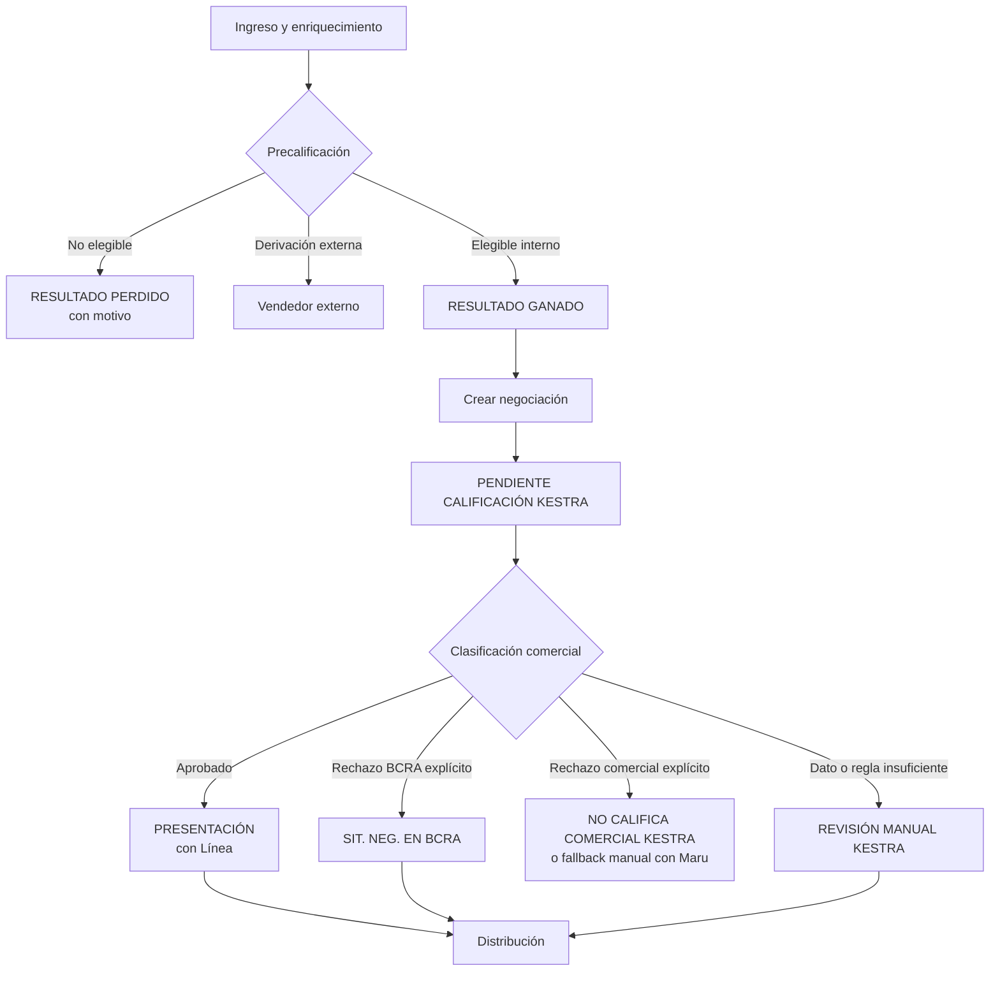
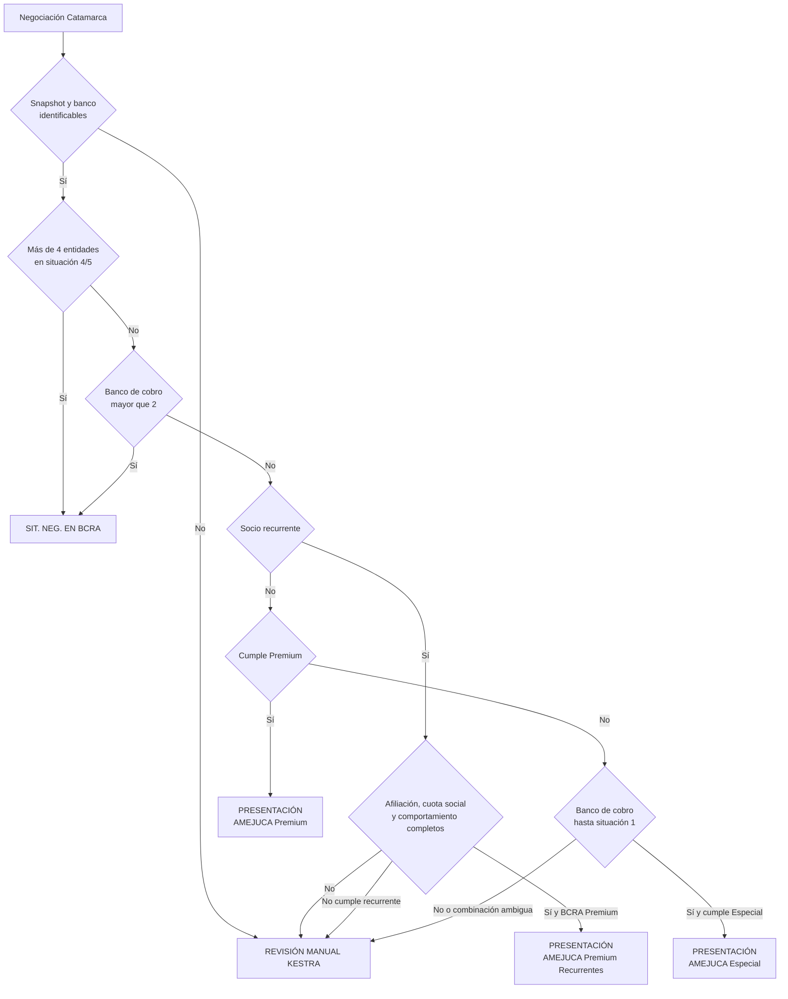
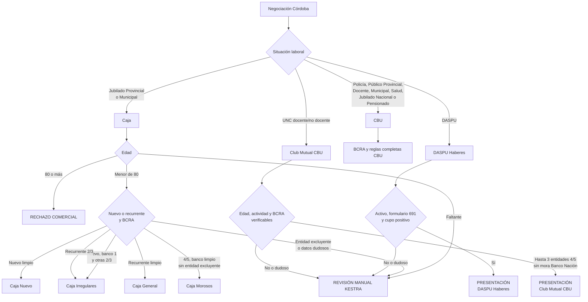

# Vista General del Proceso Comercial

Versión: `2026-08-26`

Estado: vista explicativa. Las tablas de `DEAL_CLASSIFICATION.md` son normativas.

## Proceso completo

Antes de rechazar por una línea, Kestra evalúa las demás familias habilitadas. La
ausencia de datos nunca se interpreta como rechazo.

## Catamarca — AMEJUCA

## Córdoba

## Distribución

- Dentro del horario laboral, los casos aprobados y de revisión manual se distribuyen
  según su bucket.
- Fuera del horario laboral quedan con Maru para gestión manual.
- La distribución no modifica etapa, aprobación ni línea comercial.
