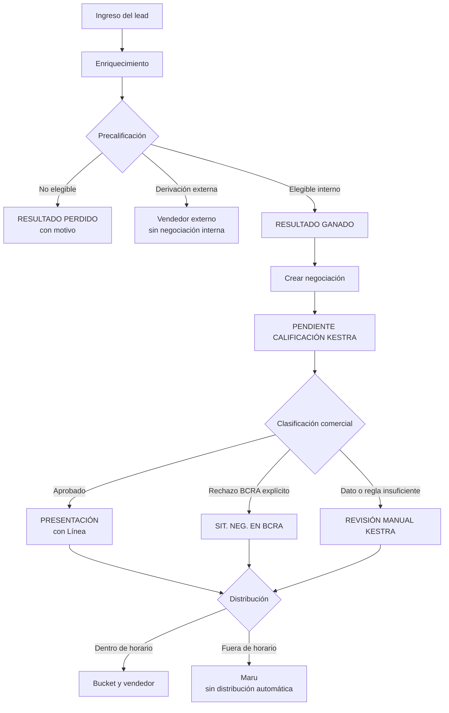
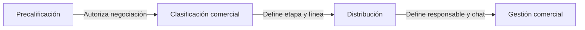
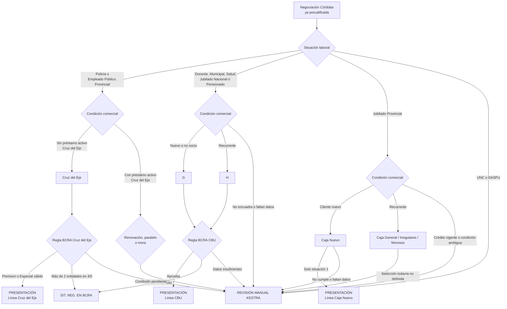

# Vista General del Proceso Comercial

Versión: `2026-08-10`

Estado: vista explicativa del modelo objetivo. Las tablas de decisión son la
especificación normativa.

Actualmente Catamarca ejecuta el ciclo completo de clasificación sobre la negociación.
Córdoba todavía crea la negociación directamente en PRESENTACIÓN; su paso por
PENDIENTE CALIFICACIÓN KESTRA corresponde al diseño que se está validando y aún no fue
implementado.

## Proceso completo

## Lectura por responsabilidad

- **Precalificación** no elige vendedores ni líneas.
- **Clasificación comercial** no elige vendedores.
- **Distribución** no cambia aprobación, etapa comercial ni línea.

## Clasificación de Córdoba — vista resumida

Estado: **borrador para validación; no implementado**.

Para Policía y Empleado Público Provincial, ser socio o tener préstamos activos de
líneas CBU propias no cambia el camino: siempre se evalúan por Cruz del Eje. Solamente
un préstamo activo de una línea Cruz del Eje habilita el análisis de renovación,
paralelo o mora de esa familia.

Esta vista muestra dónde están las decisiones, pero no contiene todos los límites ni
prioridades. Para aprobar o implementar Córdoba se debe revisar
[`DEAL_CLASSIFICATION.md`](DEAL_CLASSIFICATION.md),
[`ACCEPTANCE_CASES.md`](ACCEPTANCE_CASES.md) y
[`OPEN_DECISIONS.md`](OPEN_DECISIONS.md).
