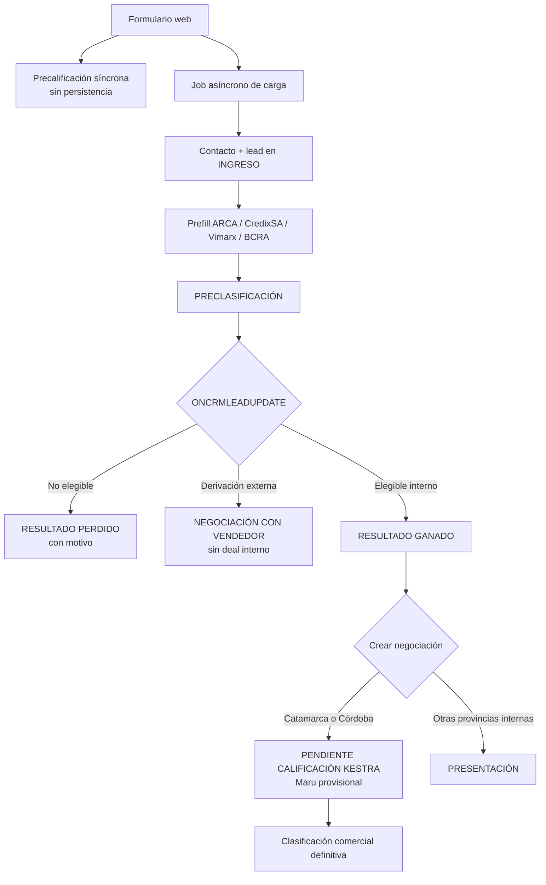

# Arquitectura Vigente del Pipeline Comercial

Versión: `2026-08-11`

Estado: describe el resultado implementado en el PR #218. Hasta su deploy, producción
conserva la clasificación Catamarca anterior y no ejecuta esta ampliación Córdoba.

## Responsabilidades

| Componente | Disparador | Responsabilidad |
|---|---|---|
| `commercial_prequalification_webhook` | Solicitud síncrona del backend web | Evalúa provincia, situación laboral y banco. No persiste ni consulta proveedores. |
| `bitrix24_form_webhook` | Job asíncrono del backend web | Crea o actualiza el contacto y crea el lead en INGRESO. No precalifica. |
| `bitrix24_lead_prefill` | Scheduler, una vez por minuto | Enriquece un lead en INGRESO mediante ARCA, CredixSA, Vimarx y BCRA; luego lo mueve a PRECLASIFICACIÓN. |
| `bitrix24_lead_won_deal_webhook` | `ONCRMLEADUPDATE` de Bitrix24 | Precalifica leads en PRECLASIFICACIÓN y crea o reutiliza la negociación al recibir RESULTADO GANADO. |
| `bitrix24_catamarca_deal_qualification` | Scheduler, una vez por minuto | Clasifica una negociación interna Catamarca o Córdoba pendiente, determina etapa y línea, y ejecuta su distribución cuando corresponde. Conserva el ID histórico. |

## Secuencia actual

## Fronteras de decisión

- El formulario no espera la persistencia para mostrar la respuesta comercial.
- El webhook de carga no decide elegibilidad.
- El prefill enriquece; no aprueba ni rechaza por BCRA.
- La precalificación reactiva decide únicamente con provincia, situación laboral y
  banco de cobro.
- La clasificación comercial definitiva ocurre sobre la negociación.
- En el PR #218 esa segunda clasificación cubre Catamarca y Córdoba; su vigencia en
  producción comienza solamente después del deploy.
- La distribución de responsables ocurre sobre la negociación, no sobre el lead.

## Ownership y corte histórico

- Todo lead creado por el intake actual recibe motor comercial Kestra.
- Para leads creados desde `2026-08-07T12:28:19-03:00`, el listener procesa cualquier
  owner previo y persiste Kestra con el resultado.
- Diego Frías (`ASSIGNED_BY_ID=7`) permanece excluido.
- Los leads anteriores al corte no se reclaman automáticamente.

## Derivación externa

La Rioja, Río Negro, Santa Fe y Neuquén no generan negociación interna cuando el caso
es elegible para derivación. El lead pasa a NEGOCIACIÓN CON VENDEDOR. Los casos que no
cumplen la elegibilidad de su provincia conservan el rechazo correspondiente.

## Distribución y horario laboral

La clasificacion comercial se ejecuta antes de aplicar las politicas de distribucion.
Los rechazos BCRA o comerciales quedan con Maru y no se distribuyen. Las aprobaciones
y revisiones manuales con bucket valido pueden participar de la distribucion y
transferencia de chat.

La ventana de distribución es continua desde el lunes a las 00:00 inclusive hasta el
viernes a las 17:00 exclusive. Fuera de ella, se conserva la linea, motivo y etapa
comercial, pero la negociación queda con Maru (`57`), sin round-robin ni transferencia
automática de chat. No se redistribuye automáticamente al siguiente día hábil.

Zona horaria: `America/Argentina/Cordoba`.

La falta temporal de vendedores dentro de la ventana usa una etapa separada,
`C1:KESTRA_QUEUE`. `bitrix24_deal_assignment_queue` reintenta un caso FIFO por bucket
y por minuto. El viernes a las 17:00 vacia la cola hacia revision manual con Maru; esos
casos no se reactivan el lunes.

La traza v2 separa `commercial_*` de `distribution_*`. Horario, bucket, cola y
disponibilidad de vendedores ya no impiden ni sobreescriben la evaluacion comercial.

## Especificaciones relacionadas

- [Clasificación comercial](../commercial-rules/DEAL_CLASSIFICATION.md)
- [Distribución](../commercial-rules/DEAL_ROUTING.md)
- [Casos de aceptación](../commercial-rules/ACCEPTANCE_CASES.md)
- [Decisiones pendientes](../commercial-rules/OPEN_DECISIONS.md)
