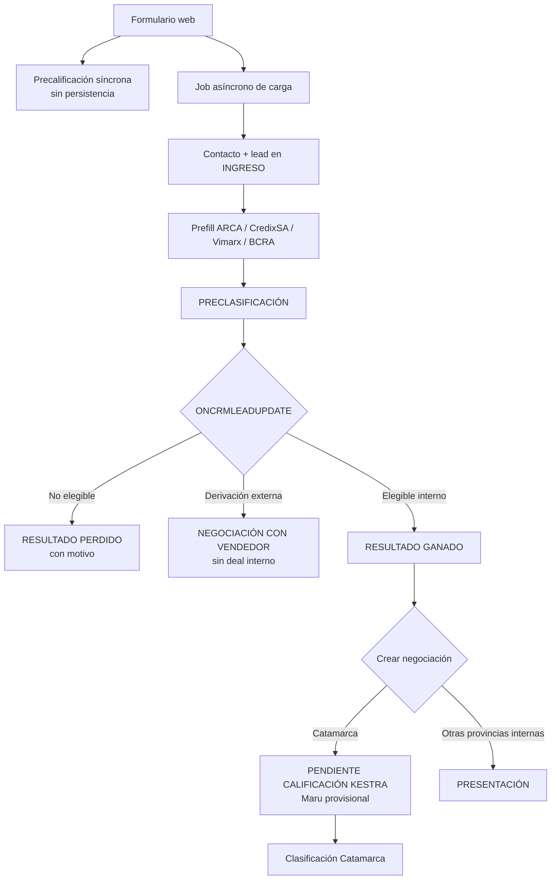

# Arquitectura Vigente del Pipeline Comercial

Versión: `2026-08-10`

## Responsabilidades

| Componente | Disparador | Responsabilidad |
|---|---|---|
| `commercial_prequalification_webhook` | Solicitud síncrona del backend web | Evalúa provincia, situación laboral y banco. No persiste ni consulta proveedores. |
| `bitrix24_form_webhook` | Job asíncrono del backend web | Crea o actualiza el contacto y crea el lead en INGRESO. No precalifica. |
| `bitrix24_lead_prefill` | Scheduler, una vez por minuto | Enriquece un lead en INGRESO mediante ARCA, CredixSA, Vimarx y BCRA; luego lo mueve a PRECLASIFICACIÓN. |
| `bitrix24_lead_won_deal_webhook` | `ONCRMLEADUPDATE` de Bitrix24 | Precalifica leads en PRECLASIFICACIÓN y crea o reutiliza la negociación al recibir RESULTADO GANADO. |
| `bitrix24_catamarca_deal_qualification` | Scheduler, una vez por minuto | Clasifica una negociación Catamarca pendiente, determina etapa y línea, y ejecuta su distribución cuando corresponde. |

## Secuencia actual

## Fronteras de decisión

- El formulario no espera la persistencia para mostrar la respuesta comercial.
- El webhook de carga no decide elegibilidad.
- El prefill enriquece; no aprueba ni rechaza por BCRA.
- La precalificación reactiva decide únicamente con provincia, situación laboral y
  banco de cobro.
- La clasificación comercial definitiva ocurre sobre la negociación.
- Actualmente esa segunda clasificación está implementada para Catamarca; Córdoba
  permanece en diseño funcional.
- La distribución de responsables ocurre sobre la negociación, no sobre el lead.

## Ownership y corte histórico

- Todo lead creado por el intake actual recibe motor comercial Kestra.
- Para leads creados desde `2026-08-07T12:28:19-03:00`, el listener procesa cualquier
  owner previo y persiste Kestra con el resultado.
- Diego Frías (`ASSIGNED_BY_ID=7`) permanece excluido.
- Los leads anteriores al corte no se reclaman automáticamente.

## Derivación externa

La Rioja, Río Negro, Santa Fe y Neuquén no generan negociación interna cuando el caso
es elegible para derivación. El lead pasa a NEGOCIACIÓN CON VENDEDOR. Los casos que no
cumplen la elegibilidad de su provincia conservan el rechazo correspondiente.

## Catamarca y horario laboral

Dentro del horario configurado, todo resultado con bucket Catamarca válido —aprobado,
revisión manual o rechazo BCRA— participa de la distribución y transferencia de chat.

Fuera de lunes a viernes de 09:00 inclusive a 17:00 exclusive, la negociación queda en
REVISIÓN MANUAL KESTRA con Maru (`57`), sin round-robin ni transferencia automática de
chat. No se redistribuye automáticamente al siguiente día hábil.

Zona horaria: `America/Argentina/Cordoba`.

## Especificaciones relacionadas

- [Clasificación comercial](../commercial-rules/DEAL_CLASSIFICATION.md)
- [Distribución](../commercial-rules/DEAL_ROUTING.md)
- [Casos de aceptación](../commercial-rules/ACCEPTANCE_CASES.md)
- [Decisiones pendientes](../commercial-rules/OPEN_DECISIONS.md)
